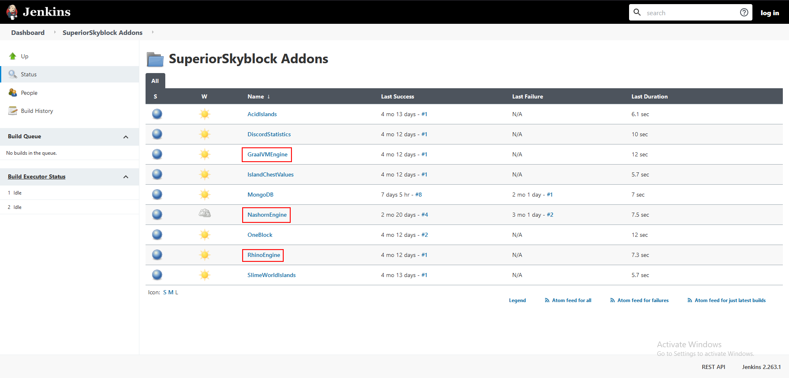
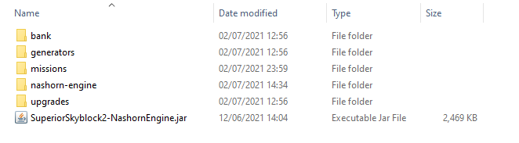

# Javascript Engine


This process is done automatically by the plugin after versions 1.8.1.360


If you want to use Java 15 and you want to use SuperiorSkyblock as well, you must download an external scripts engine. The script engine is used for various of things in the plugin, including calculation of levels, for missions and more.

## How to install an external scripts engine?

There are multiple different script engines available, but this tutorial will be focused on Nashron Engine. This is the default and most common engine to use. You may find a link to its github [here](https://github.com/BG-Software-LLC/SuperiorSkyblock2-NashornEngine/).\
You may find more information about the other scripts under the [addons page](addons/).


Note: If you choose to use GraalVM Engine, make sure you have GraalVM set up correctly!


### First Step: Download the engine jar

First of all, download your wanted scripts engine. You may find builds to all of our script-engines on our [Jenkins page](https://hub.bg-software.com/job/SuperiorSkyblock%20Addons/).

### Second Step: Add the engine to your modules folder

After you downloaded the jar, you need to move it to the modules folder. This process is similar to the process of installing a regular plugin! Simply take the jar and drag it to your modules folder under SuperiorSkyblock's folder.

### Last Step: Start your server!

This is the last step - simply start your server again! The plugin will load the module and set up everything for you! If you get into trouble or something doesn't work for you, make sure you contact us on out [discord server](https://bg-software.com/discord/).
